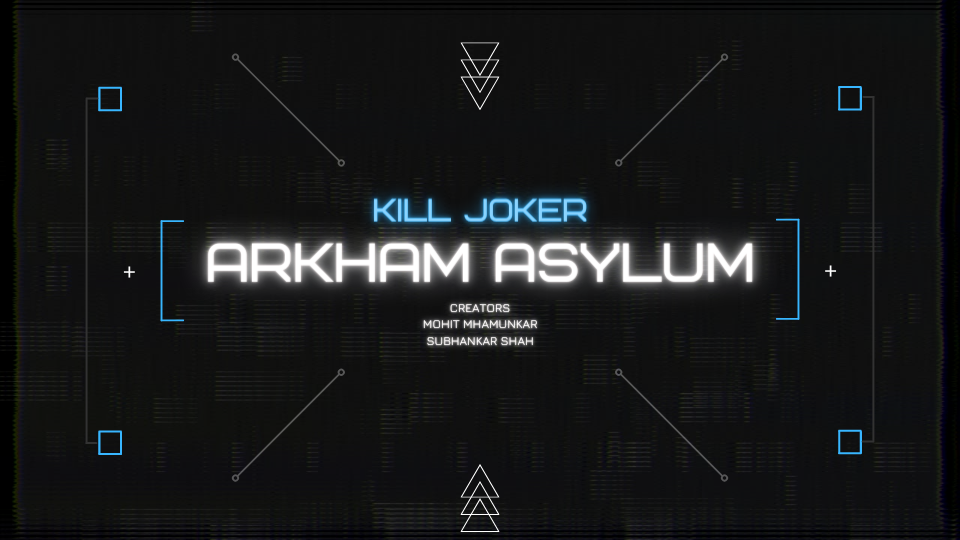

## Kill The Joker - Arkham Asylum

**Kill The Joker** is a multi-player game set in the Arkham Asylum world. Players take on the roles of inmates trying to hunt down and kill the Joker, who is one of the characters controlled by the game.

[]

### Game Overview

* The game is played on a map of the Arkham Asylum consisting of multiple interconnected rooms/spaces.
* Players can move between neighboring rooms, pick up items/weapons, and attack the Joker or other players when certain conditions are met.
* The goal is to reduce the Joker's health to 0 using various items/weapons in the players' inventories.
* The game continues until either the Joker is killed or a maximum number of turns is reached.

### Features

* Support for multiple human and computer players in a single game.
* Depth-first traversal for moving a pet character automatically across rooms.
* Option to start a new game with an existing or new map configuration.
* Display information about players, rooms, and their contents.
* Menu system to perform various actions like moving, picking up items, attacking, etc.

### Requirements

* Java Development Kit (JDK) installed on your system.
* An integrated development environment (IDE) like IntelliJ IDEA, Eclipse, or NetBeans.

### Installation

1. Clone the repository or download the source code.
2. Open the project in your preferred IDE.
3. Build and run the project.

### Usage

Upon starting the game, you will be prompted to enter the number of players and their details. Follow the on-screen instructions to navigate through the game menu and perform actions like moving, picking up items, attacking the Joker, and more.

Refer to the in-game help or documentation for detailed instructions on gameplay mechanics and available commands.
